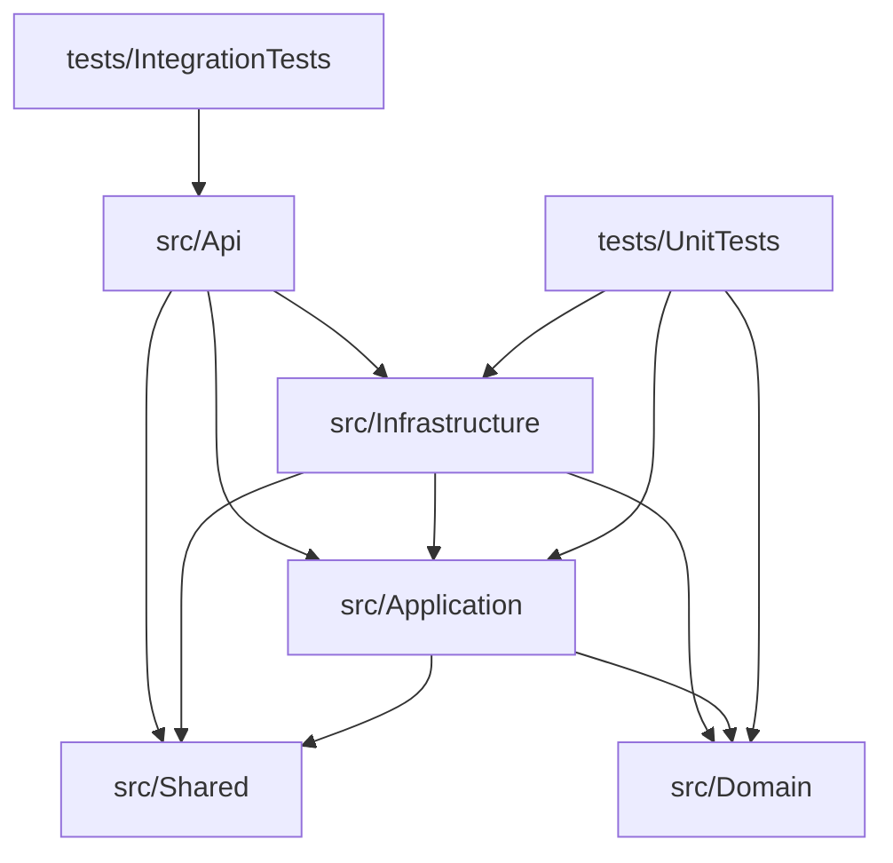

# EcfDgii.Client API & SDK — Dominican Republic Electronic Invoicing

[](https://dotnet.microsoft.com/download)
[](https://learn.microsoft.com/en-us/ef/core/)
[](https://www.postgresql.org/)
[](https://github.com/jbogard/MediatR)
[](LICENSE)

---

**EcfDgii.Client** is an enterprise-grade solution that wraps and exposes the Dominican Republic Tax Authority's (**DGII**) Comprobante Fiscal Electrónico (**e-CF**) SOAP/REST integration services. Refactored under **Clean Architecture** and **Domain-Driven Design (DDD)** principles, this solution provides a robust REST API wrapper, secure JWT-based authentication, PostgreSQL persistence with automated auditing and soft-delete, FluentValidation rules, correlation logging, and full Docker orchestration support.

---

## Table of Contents

- [What's New in Refactored v2.0.0](#whats-new-in-refactored-v200)
- [Overview](#overview)
- [Key Features](#key-features)
- [Solution Structure](#solution-structure)
- [Installation & Setup](#installation--setup)
- [Dependencies](#dependencies)
- [Basic Configuration](#basic-configuration)
- [Security & JWT Authentication](#security--jwt-authentication)
- [XML Digital Signature (XMLDSig)](#xml-digital-signature-xmldsig)
- [API Endpoints Reference](#api-endpoints-reference)
- [JSON Request & Response Examples](#json-request--response-examples)
- [Database Persistence & Migrations](#database-persistence--migrations)
- [Complete Core API Interfaces](#complete-core-api-interfaces)
- [Performance Considerations](#performance-considerations)
- [Best Practices](#best-practices)
- [Complete Workflows](#complete-workflows)
- [Docker Orchestration](#docker-orchestration)
- [Diagnostics & Testing](#diagnostics--testing)
- [License](#license)
- [Contact](#contact)
- [Support](#support)

---

## What's New in Refactored v2.0.0

This release marks a complete architectural migration from a legacy single Class Library SDK into a production-ready enterprise solution built with ASP.NET Core 10, Entity Framework Core, PostgreSQL, and CQRS via MediatR.

### Security Fixes

| Refactoring Area | Legacy SDK Limitation | v2.0.0 Enterprise Solution |
|---|---|---|
| **API Authentication** | No API-level protection; endpoints could be called anonymously. | Secure JWT Bearer Token validation using `Microsoft.AspNetCore.Authentication.JwtBearer`. |
| **Password Hashing** | No secure mechanism to manage credentials or register users. | BCrypt-based hashing via `BCrypt.Net-Next` for user login validation. |
| **Credential Storage** | Certificates, credentials, and endpoints hardcoded in code or plain settings. | Typed configuration options bound automatically via `IOptions<EcfClientOptions>`. |

### Architectural Enhancements

| Refactoring Area | Legacy SDK Limitation | v2.0.0 Enterprise Solution |
|---|---|---|
| **Layered Structure** | Monolithic codebase where controllers, business logic, and SDK services coexisted. | **Clean Architecture** split into 5 core projects (`Domain`, `Application`, `Infrastructure`, `Shared`, `Api`). |
| **Dependency Inversion** | Application layer and API controllers depended directly on concrete implementations. | Interface-driven architecture using domain abstractions like `IEcfClient` and `IEcfXmlSerializer`. |
| **Business Flow** | Direct client wrapping inside fat controllers and request processors. | **CQRS** pattern implemented using MediatR handlers for register, login, customer management, and e-CF submittals. |

### Robustness & Persistence Fixes

| Refactoring Area | Legacy SDK Limitation | v2.0.0 Enterprise Solution |
|---|---|---|
| **Local Database** | e-CF transactions were processed only in-memory, leading to data loss on restarts. | Local PostgreSQL repository tracking every submitted e-CF and customer model. |
| **Audit Logs & Soft Delete**| Auditable timestamps updated manually; hard deletion of customer data. | Base entity `AuditableEntity` auto-updates auditing properties in `SaveChangesAsync()`, implementing soft-delete global filters. |
| **Error Handling** | Raw custom exceptions thrown directly to clients, leaking implementation details. | Standardized **ProblemDetails** global middleware matching the RFC 9457 specification. |

### Breaking behavior change (v2.0.0)

> **Auto-Migrations at Startup:** In development, database migrations are automatically executed against the configured PostgreSQL instance.
>
> **Mandatory Authentication:** All endpoints (except `/api/auth/register` and `/api/auth/login`) require a valid JWT bearer token.
>
> **Default Admin Credentials:** A default admin user is seeded during migrations. Plaintext credentials:
> - **Username:** `admin`
> - **Password:** `AdminPassword123!`

---

## Overview

The `EcfDgii.Client` solution acts as a middleware between internal billing platforms and the Dominican Republic Tax Authority (DGII) server systems. It automates XML serialization, digital signing (XMLDSig / XAdES), authentication token acquisition, document transmission, and status querying.



---

## Key Features

### e-CF Operations
- **Single e-CF Sending**: Prepares, validates, signs, and posts signed XML tax receipts directly to DGII REST services.
- **RFCE Summaries**: Automatic validation, serialization, signing, and transmission of Consumption Invoice Summaries (RFCE).
- **DGII Status Syncing**: Polls local and external services to sync transaction statuses (TrackId results) directly to the PostgreSQL database.
- **Sequence Collision Recovery**: Automatically retries transmitting with a newly acquired sequence number if the DGII responds with a sequence-in-use error.

### Cryptography & Security
- **JWT Authorization**: Protects REST API endpoints with JWT token verification and role policies.
- **XMLDSig (RSA-SHA256)**: Digitally signs invoices using enveloped signature transformations and validates certificate RNC ownership.
- **Auditing & Tracking**: Automatically registers creation, update, and soft deletion dates/users for all tables.

### Enterprise Observability
- **Serilog Logging**: Complete request/response correlation logging, stack trace capture, and rolling file writes.
- **OpenTelemetry Instrumentation**: Distributed tracing and metrics for ASP.NET Core API and EF Core PostgreSQL database operations.
- **Scalar OpenAPI Interface**: Next-gen documentation and sandbox console exposed natively in development environments.

---

## Solution Structure

```text
src/
├── Domain/              # Enterprise core, entities, value objects, exceptions, and abstractions
│   ├── Common/          # AuditableEntity base model
│   ├── Entities/        # User, Customer, EcfDocument, Rfce schemas
│   ├── Interfaces/      # Abstractions (IEcfClient, IEcfXmlSerializer, Repositories)
│   └── Exceptions/      # Domain specific exceptions (EcfSigningException, EcfValidationException)
├── Application/         # Application use cases, MediatR handlers, validation rules
│   ├── Common/          # Logging and Validation pipeline behaviors
│   ├── Customers/       # Customer CRUD handlers
│   ├── Ecf/             # SendEcf, SendRfce, and GetStatus handlers
│   └── Auth/            # Authentication use cases
├── Infrastructure/      # Concrete implementations, database contexts, soap clients
│   ├── Persistence/     # ApplicationDbContext, repository configurations, migrations
│   ├── Security/        # PasswordHasher, TokenService, XML Signer
│   ├── Serialization/   # XML serializer helpers
│   └── Dgii/            # Direct transport REST client and token managers
├── Shared/              # Shared libraries (Result wrapper pattern)
└── Api/                 # ASP.NET Core host, controllers, middleware, and services
```

---

## Installation & Setup

### Method 1: Manual Run
1. Clone the repository:
   ```bash
   git clone https://github.com/JorgeGBeltre/EcfDgi.Client.git
   cd EcfDgi.Client
   ```
2. Build the solution:
   ```bash
   dotnet build e-CF.sln
   ```
3. Start the API project:
   ```bash
   dotnet run --project src/Api/Api.csproj
   ```

### Method 2: Docker Compose Run
1. Run the entire database and API stack:
   ```bash
   docker compose up --build -d
   ```
2. Verify execution using the docker logs:
   ```bash
   docker logs ecf_dgii_api -f
   ```

---

## Dependencies

```xml
<!-- Core Database & EF Core -->
<PackageReference Include="Npgsql.EntityFrameworkCore.PostgreSQL" Version="10.0.2" />
<PackageReference Include="Microsoft.EntityFrameworkCore.Design" Version="10.0.9" />

<!-- Core Request Handling & CQRS -->
<PackageReference Include="MediatR" Version="12.4.1" />
<PackageReference Include="FluentValidation.DependencyInjectionExtensions" Version="11.11.0" />

<!-- Security, Auth & Cryptography -->
<PackageReference Include="Microsoft.AspNetCore.Authentication.JwtBearer" Version="10.0.9" />
<PackageReference Include="BCrypt.Net-Next" Version="4.0.3" />
<PackageReference Include="System.Security.Cryptography.Xml" Version="10.0.0-preview.2.25163.2" />

<!-- Logging & API Documentation -->
<PackageReference Include="Serilog.AspNetCore" Version="10.0.0" />
<PackageReference Include="Scalar.AspNetCore" Version="2.16.6" />
<PackageReference Include="OpenTelemetry.Extensions.Hosting" Version="1.16.0" />
```

---

## Basic Configuration

The DI lifecycle is configured in two clean extension methods: `AddApplicationServices()` and `AddInfrastructureServices(IConfiguration)`.

### Registering Clean Architecture Services

```csharp
// Program.cs
builder.Services.AddApplicationServices();
builder.Services.AddInfrastructureServices(builder.Configuration);
```

### Complete `appsettings.json` Template

Configure your databases, credentials, and signing certificates in `src/Api/appsettings.json`:

```json
{
  "ConnectionStrings": {
    "DefaultConnection": "Host=localhost;Port=5432;Database=ecf_dgii;Username=postgres;Password=postgres"
  },
  "JwtSettings": {
    "Secret": "e_CF_Dominican_Tax_Authority_Secure_JWT_Secret_Token_2026_Key_Length_Minimum_32_Bytes!",
    "ExpirationMinutes": 60,
    "Issuer": "EcfDgiiClientIssuer",
    "Audience": "EcfDgiiClientAudience"
  },
  "EcfClientOptions": {
    "ApiKey": "",
    "BaseUrl": "https://ecf.dgii.gov.do",
    "Environment": "Test",
    "Mode": "DgiiDirect",
    "RncEmisor": "101672919",
    "CertificatePath": "C:/config/credentials/dgii_certificate.p12",
    "CertificatePassword": "SecurePassword123",
    "AutoRetryOnReuseableSequence": true
  }
}
```

---

## Security & JWT Authentication

### Configuring JWT
Authentication options are read directly into `JwtSettings` and configured with symmetric security validation keys:

```csharp
var jwtSettingsSection = builder.Configuration.GetSection("JwtSettings");
var jwtSettings = jwtSettingsSection.Get<JwtSettings>();
var key = Encoding.ASCII.GetBytes(jwtSettings.Secret);

builder.Services.AddAuthentication(options =>
{
    options.DefaultAuthenticateScheme = JwtBearerDefaults.AuthenticationScheme;
    options.DefaultChallengeScheme = JwtBearerDefaults.AuthenticationScheme;
})
.AddJwtBearer(options =>
{
    options.RequireHttpsMetadata = false;
    options.SaveToken = true;
    options.TokenValidationParameters = new TokenValidationParameters
    {
        ValidateIssuerSigningKey = true,
        IssuerSigningKey = new SymmetricSecurityKey(key),
        ValidateIssuer = true,
        ValidIssuer = jwtSettings.Issuer,
        ValidateAudience = true,
        ValidAudience = jwtSettings.Audience,
        ClockSkew = TimeSpan.Zero
    };
});
```

---

## XML Digital Signature (XMLDSig)

The cryptographic signature of XML receipts is handled by the `EcfXmlSigner` service. It extracts the private key from the client certificate, validates that the certificate matches the sender's RNC, computes an RSA-SHA256 digest, and appends the `<Signature>` block.

```csharp
// EcfXmlSigner.cs
public string SignXml(string xmlContent, string rncEmisor)
{
    if (!ValidateCertificateSn(rncEmisor))
        throw new EcfSigningException($"El RNC del certificado no coincide con el emisor: {rncEmisor}");

    var doc = new XmlDocument { PreserveWhitespace = false };
    doc.LoadXml(xmlContent);

    var signedXml = new SignedXml(doc);
    signedXml.SigningKey = _certificate.GetRSAPrivateKey();
    signedXml.SignedInfo.SignatureMethod = "http://www.w3.org/2001/04/xmldsig-more#rsa-sha256";

    var reference = new Reference { Uri = "" };
    reference.AddTransform(new XmlDsigEnvelopedSignatureTransform());
    reference.AddTransform(new XmlDsigExcC14NTransform());
    reference.DigestMethod = "http://www.w3.org/2001/04/xmlenc#sha256";
    signedXml.AddReference(reference);

    var keyInfo = new KeyInfo();
    keyInfo.AddClause(new KeyInfoX509Data(_certificate));
    signedXml.KeyInfo = keyInfo;

    signedXml.ComputeSignature();
    var xmlDigitalSignature = signedXml.GetXml();
    doc.DocumentElement?.AppendChild(doc.ImportNode(xmlDigitalSignature, true));

    return doc.OuterXml;
}
```

---

## API Endpoints Reference

All endpoints except `Auth` require a valid JWT Bearer header: `Authorization: Bearer <your-token>`.

| Route | Method | Authentication | Request Body | Description |
| :--- | :--- | :--- | :--- | :--- |
| `/api/auth/register` | `POST` | Anonymous | `RegisterUserCommand` | Creates a new user |
| `/api/auth/login` | `POST` | Anonymous | `LoginUserCommand` | Verifies user password and yields JWT token |
| `/api/customers` | `GET` | Bearer Token | None | Returns a list of active customers |
| `/api/customers/{id}` | `GET` | Bearer Token | None | Retrieves a customer by ID |
| `/api/customers` | `POST` | Bearer Token | `CreateCustomerCommand` | Creates a new customer record |
| `/api/customers/{id}` | `PUT` | Bearer Token | `UpdateCustomerCommand` | Updates an existing customer record |
| `/api/customers/{id}` | `DELETE` | Admin Role | None | Soft-deletes a customer |
| `/api/ecf/send` | `POST` | Bearer Token | `SendEcfCommand` | Signs and sends an XML e-CF document |
| `/api/ecf/send-rfce` | `POST` | Bearer Token | `SendRfceCommand` | Signs and sends a Consumption Summary |
| `/api/ecf/status` | `GET` | Bearer Token | Query Parameters | Queries current processing status |

---

## JSON Request & Response Examples

### 1. User Registration (`POST /api/auth/register`)

**Request Payload:**
```json
{
  "username": "jorge_admin",
  "email": "jorge@domain.com",
  "password": "SecurePassword123!",
  "role": "Admin"
}
```

**Response Payload (200 OK):**
```json
{
  "username": "jorge_admin",
  "token": "eyJhbGciOiJIUzI1NiIsInR5cCI6IkpXVCJ9...",
  "role": "Admin"
}
```

### 2. User Login (`POST /api/auth/login`)

**Request Payload:**
```json
{
  "username": "jorge_admin",
  "password": "SecurePassword123!"
}
```

**Response Payload (200 OK):**
```json
{
  "username": "jorge_admin",
  "token": "eyJhbGciOiJIUzI1NiIsInR5cCI6IkpXVCJ9...",
  "role": "Admin"
}
```

### 3. Send e-CF invoice (`POST /api/ecf/send`)

**Request Payload:**
```json
{
  "xmlContent": "<eCF xmlns=\"http://dgii.gov.do/eCF\">...</eCF>",
  "fileName": "101672919E3100000001.xml",
  "rncEmisor": "101672919",
  "eNcf": "E310000000001",
  "rncComprador": "22400013743",
  "totalAmount": 1180.00,
  "itbisAmount": 180.00
}
```

**Response Payload (200 OK):**
```json
{
  "trackId": "d748f219-c0ad-4d43-9878-837cc21087ab",
  "error": null,
  "mensaje": "e-CF recibido exitosamente"
}
```

---

## Database Persistence & Migrations

Database configurations map columns to database `snake_case` properties. The `ApplicationDbContext` intercepts entities derived from `AuditableEntity` to execute auditing writes and soft deletion.

```csharp
// CustomerConfiguration.cs
public void Configure(EntityTypeBuilder<Customer> builder)
{
    builder.ToTable("customers");
    builder.HasKey(c => c.Id).HasName("pk_customers");
    builder.Property(c => c.Id).HasColumnName("id");
    builder.Property(c => c.Name).HasColumnName("name").HasMaxLength(150).IsRequired();
    builder.Property(c => c.Email).HasColumnName("email").HasMaxLength(150).IsRequired();
    builder.Property(c => c.Rnc).HasColumnName("rnc").HasMaxLength(20).IsRequired();
    
    // Auditable columns mapping
    builder.Property(c => c.IsDeleted).HasColumnName("is_deleted").IsRequired();
    builder.Property(c => c.CreatedAt).HasColumnName("created_at").IsRequired();
    builder.Property(c => c.CreatedBy).HasColumnName("created_by").HasMaxLength(100);
}
```

### CLI Command Reference
Run these commands from the root directory:

```bash
# Add new database migration
dotnet ef migrations add InitialCreate --project src/Infrastructure --startup-project src/Api --output-dir Persistence/Migrations

# Apply migration changes directly to PostgreSQL
dotnet ef database update --project src/Infrastructure --startup-project src/Api

# Generate idempotent SQL script for Production pipelines
dotnet ef migrations script --idempotent --output script.sql --project src/Infrastructure --startup-project src/Api
```

---

## Complete Core API Interfaces

These abstractions separate use cases in the Application layer from concrete implementations in the Infrastructure layer.

```csharp
// IEcfClient.cs
namespace EcfDgii.Client.Domain.Interfaces
{
    public interface IEcfClient
    {
        Task<EcfRecepcionResponse> SendEcfAsync(string xmlContent, string fileName, CancellationToken ct = default);
        Task<RfceRecepcionResponse> SendRfceAsync(Rfce rfce, CancellationToken ct = default);
        Task<ConsultaResultadoResponse> ConsultarResultadoAsync(string trackId, CancellationToken ct = default);
        Task<ConsultaEstadoResponse> ConsultarEstadoAsync(string rncEmisor, string eNcf, string? rncComprador = null, string? codigoSeguridad = null, CancellationToken ct = default);
        Task<List<TrackIdDetalle>> ConsultarTrackIdsAsync(string rncEmisor, string eNcf, CancellationToken ct = default);
        Task<RfceConsultaResponse> ConsultarRfceAsync(string rncEmisor, string eNcf, string codigoSeguridad, CancellationToken ct = default);
        Task<TimbreResponse> ValidarTimbreEcfAsync(TimbreEcfRequest request, CancellationToken ct = default);
        Task<TimbreFcResponse> ValidarTimbreFcAsync(TimbreFcRequest request, CancellationToken ct = default);
        Task<List<DirectorioContribuyente>> ConsultarDirectorioAsync(CancellationToken ct = default);
        Task<List<EstatusServicio>> ConsultarEstatusServiciosAsync(CancellationToken ct = default);
        Task<List<VentanaMantenimiento>> ConsultarVentanasMantenimientoAsync(CancellationToken ct = default);
        Task<string> VerificarEstadoAmbienteAsync(AmbienteEnum ambiente, CancellationToken ct = default);
        Task<AnulacionResponse> AnularRangosAsync(string xmlContent, CancellationToken ct = default);
    }
}

// IEcfXmlSerializer.cs
namespace EcfDgii.Client.Domain.Interfaces
{
    public interface IEcfXmlSerializer
    {
        string Serialize<T>(T model) where T : class;
        T Deserialize<T>(string xml) where T : class;
        string GetFileName(string rncEmisor, string eNcf);
        string EscapeAlfanum(string value);
    }
}

// IEcfSequenceProvider.cs
namespace EcfDgii.Client.Domain.Interfaces
{
    public interface IEcfSequenceProvider
    {
        Task<string> GetNextAsync(string rncEmisor, CancellationToken ct = default);
        Task ReleaseAsync(string rncEmisor, string eNcf, CancellationToken ct = default);
    }
}
```

---

## Performance Considerations

### Performance Tuning
- **HTTP Client Connection Pooling**: `HttpClient` is registered once and shared using dependency injection to prevent socket exhaustion.
- **EF Core AsNoTracking**: Queries that only return read data use `AsNoTracking` to skip memory allocation for changes.
- **XML Serializer Reuse**: Standardizes XML parser instantiations to avoid generating assembly files dynamically on each serializing request.

---

## Best Practices

1. **Use HTTPS and TLS 1.3**: Ensure that connections to the API and to DGII endpoints are strictly encrypted using TLS 1.3/1.2 protocols.
2. **Store P12/PFX Certificates Safely**: Avoid placing your digital certificate file inside any public folders. Rely on secure environment configurations or cloud storage (AWS Secrets Manager/Azure KeyVault).
3. **Always Register the Pipeline Middleware**: The `GlobalExceptionMiddleware` ensures validation errors are formatted cleanly into RFC-compliant responses, preventing detailed exceptions from exposing system layers.

---

## Complete Workflows

### Successful e-CF Invoice Submission Workflow

```
Client App                   EcfDgii.Client API              DGII Gateway
   │                                 │                             │
   │── POST /api/ecf/send ──────────►│                             │
   │   (JWT authentication check)    │── 1. Sign XML (XMLDSig)     │
   │                                 │── 2. Authenticate token     │
   │                                 │── 3. Post payload ─────────►│
   │                                 │◄── 4. Return TrackId ───────│
   │                                 │                             │
   │                                 │── 5. Save to local Database │
   │◄── Return TrackId ──────────────│                             │
```

### e-CF Sequence Reuse Auto-Retry Workflow

```
Application Handler          EcfClient Service              DGII Gateway
   │                                 │                             │
   │── SendRfceAsync ───────────────►│                             │
   │                                 │── Send to DGII ────────────►│
   │                                 │◄── Rejected (Sequence Used)─│
   │                                 │                             │
   │                                 │── 1. Get next sequence      │
   │                                 │── 2. Re-sign XML payload    │
   │                                 │── 3. Resend payload ───────►│
   │                                 │◄── Accepted (Success) ──────│
   │◄── Return Success ──────────────│                             │
```

---

## Docker Orchestration

The API stack uses Docker Compose, linking the REST wrapper API container and a PostgreSQL database.

### Dockerfile (`./Dockerfile`)

```dockerfile
FROM mcr.microsoft.com/dotnet/aspnet:10.0 AS base
WORKDIR /app
EXPOSE 8080

FROM mcr.microsoft.com/dotnet/sdk:10.0 AS build
WORKDIR /src
COPY . .
RUN dotnet restore "./src/Api/Api.csproj"
WORKDIR "/src/src/Api"
RUN dotnet publish "./Api.csproj" -c Release -o /app/publish

FROM base AS final
WORKDIR /app
COPY --from=build /app/publish .
ENTRYPOINT ["dotnet", "Api.dll"]
```

### Docker Compose (`./docker-compose.yml`)

```yaml
version: '3.8'
services:
  postgres:
    image: postgres:15-alpine
    container_name: ecf_dgii_postgres
    environment:
      POSTGRES_DB: ecf_dgii
      POSTGRES_USER: postgres
      POSTGRES_PASSWORD: postgres
    ports:
      - "5432:5432"
    volumes:
      - postgres_data:/var/lib/postgresql/data

  api:
    build:
      context: .
      dockerfile: Dockerfile
    container_name: ecf_dgii_api
    ports:
      - "8080:8080"
    environment:
      - ConnectionStrings__DefaultConnection=Host=postgres;Port=5432;Database=ecf_dgii;Username=postgres;Password=postgres
    depends_on:
      - postgres

volumes:
  postgres_data:
```

---

## Diagnostics & Testing

### Running Tests
Execute the xUnit test runner from the root folder:

```bash
# Run unit & integration tests
dotnet test e-CF.sln
```

### Health Checks Endpoint
Check API status by requesting the `/health` endpoint:

**Example Request:**
```bash
curl http://localhost:8080/health
```

**Example Response:**
```json
{
  "status": "Healthy"
}
```

### Scalar UI Interface
OpenApi documentation is compiled and rendered on Development runs under:
`http://localhost:8080/scalar/v1`

---

## License

Licensed under the **MIT License**. See [LICENSE](LICENSE) for details.

---

## Contact

Author: **Jorge Gaspar Beltre Rivera**  
Project: **EcfDgii.Client API & SDK**

 [](https://github.com/JorgeGBeltre)
 [](https://www.linkedin.com/in/jorge-gaspar-beltre-rivera/)
 [](mailto:Jorgegaspar3021@gmail.com)

---

## Support

This project is developed independently.

Even a small contribution helps me dedicate more time to development, testing, and releasing new features.

 [](https://www.paypal.com/donate/?hosted_button_id=2VLA8BWT967LU)
